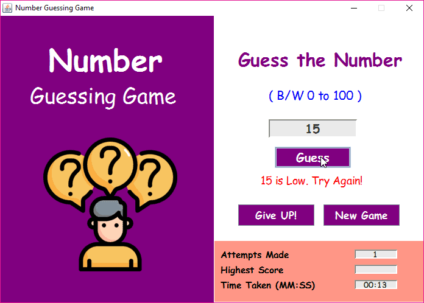
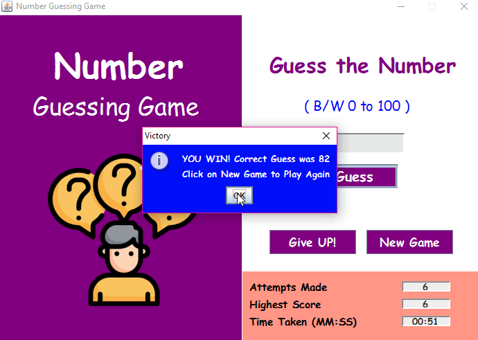
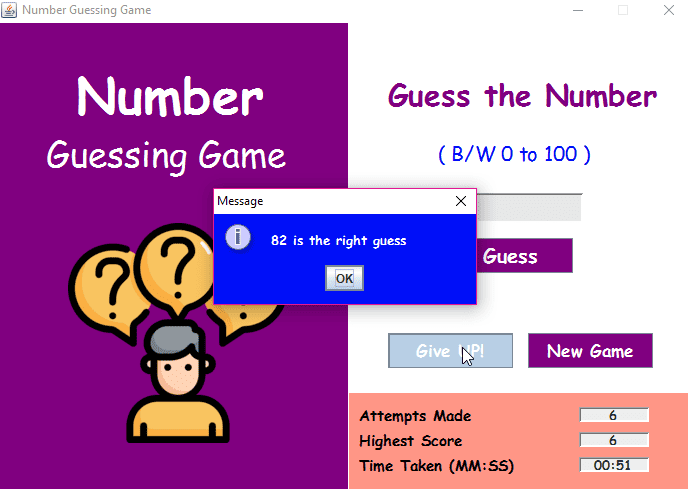

# 🎮 Java Swing Number Guessing Game

This is a simple GUI-based **Number Guessing Game** built using **Java Swing**.

## 🚀 How it Works

- A random number between 0 and 100 is generated.
- The user guesses the number.
- If correct, a **Victory** message is shown.
- If wrong, a **hint** is given (Too High / Too Low).
- You can also:
  - Start a **New Game**
  - **Give Up** and reveal the number

## 📊 Features

- Attempts counter
- Time tracker
- Highest score
- GUI layout using Java Swing

## 🖼️ Screenshots

## 📁 File

- `GuessingGameJava.java` → Main source code

## 📃 License

This project is for learning and portfolio use only.
